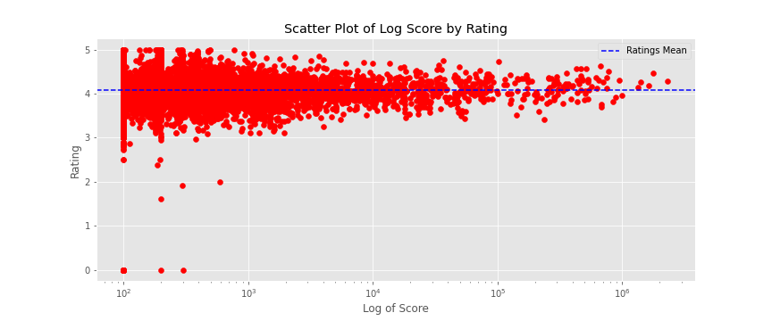
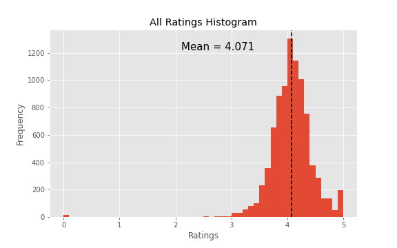
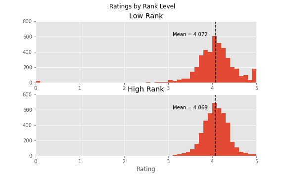
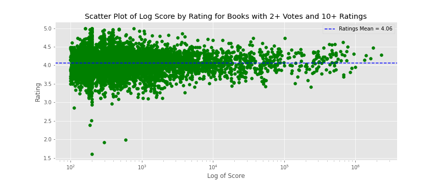
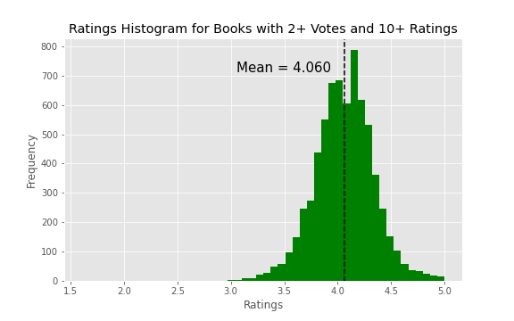
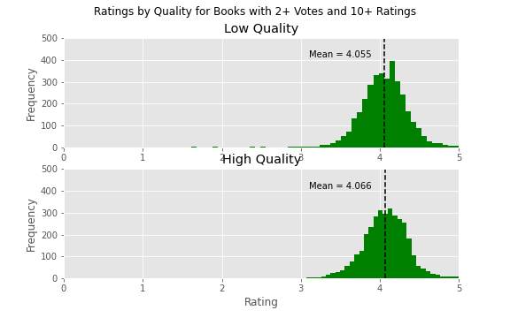
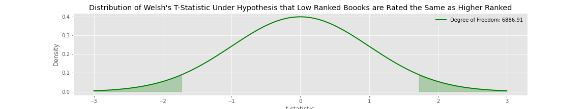

# 
 Goodreads Book Ratings - A "Quality" Analysis 

## 
 Are higher quality Goodreads books rated higher? 

## Introduction
Goodreads.com is a social media website that allows users to share, rate, and review books they have read (or haven't...who knows?). Readers are able to rate the books they read on a 5-point scale:

* 1 star – didn't like it
* 2 stars – it was OK
* 3 stars – liked it
* 4 stars – really liked it
* 5 stars – it was amazing

Another freature of goodreads is the book lists they put together. Go to their [Listopia](https://www.goodreads.com/list)
page to check out some of the lists. Lists can be added to by anyone, and for that reason, lists can grow to be extremely large. Even lists that are supposed to be "Top 100" can stretch well past the century mark. Additionally, many books towards the end of the list (or not even near the end, depending on how long the list is) are books that were added by only one person and have only one vote. These books also are more likely to have full 5-star ratings, but this is because they have only been rated a handful of times.

## Motivation and Question
It only takes a short time on goodreads to realize that the ratings on books appear to be all over the map. The only consistency I have been able to determine is that the book ratings appear to have no consistency at all! That, and the fact that almost all books that have at least a handful of ratings rarely seem to fall below about a 3. This probably speaks to the theory that most people will post and rate books they liked. Unfortunately, if I am looking for my next quality book to read, I am not sure if I can trust the book ratings.

Therefore, the question I will be asking is whether books that are "higher quality" are actually rated higher on goodreads. Since "higher quality" is a subjective measure, I have chosen to use the [Books Everyone Should Read At Least Once](https://www.goodreads.com/list/show/264.Books_That_Everyone_Should_Read_At_Least_Once) list on goodreads, because this list contains many higly ranked books that are widely regarded as classics (or modern classics).

## Data

Data was scraped from the list described above. The data set consists of the top 8,800 books from the aforementioned list. This quantity of books allows for a robust data set before running too far into the list of "single vote and few rating" books described above. In fact, in a further effort to combat this problem, after running an initial test on the entire list, the data set is subsetted to 6,895 books that have been rated at least 10 times, and have at least two votes and the tests are run again on that sample.

This data set contains several features necessary to analyze the question:

* Ranking of the book in the list
* Score that determines the ranking in the list (based on votes and ratings)
* Average rating of the book on a 5-point scale
* Indicator of higher versus lower quality books

Higher versus lower quality books in the list are defined by a simple metric. If they are in the top half of the list, they are considered "higher quality" books and if they are in the bottom half of the list, they are considered "lower quality" books.
* Note - books that were tied on score share the same rank. As a result, the high and low quality books categories do not each contain exactly half of the books.

## Results

### All books (n=8,800)

A scatter plot of average rating of each book against its score does not show any discernible difference in the mean of the ratings as score increases.

The histogram of the ratings show that they are normally distributed.
* Mean = 4.071
* Standard Deviation = 0.379

When the ovearll data set is split by quality, ratings for both groups of books are normally distributed.
* Low Quality Books
    * Mean = 4.072
    * Standard Deviation = 0.454
* High Quality Books
    * Mean = 4.069
    * Standard Deviation: 0.286

We can see that the mean rating score for the lower quality books is actually slightly higher than the mean rating score for the higher quality of books. This is likely largely due to the higher number of 5-star rated books, visible in the plot of low quality books.

A Welch's t-test indicates there is no statistical difference between the ratings of the low and high quality books.

* Hypotheses
    * Null: Mean Low Quality Rating = Mean High Quality Rating
    * Alternative: Mean Low Quality Rating ≠ Mean High Quality Rating

* Results
    * t = 0.370
    * p = 0.711

### Books with at least 2 votes and at least 10 ratings (condensed)

A look at the scatter plots of the average rating of each book against its score for the "condensed" set of books looks very similar to the scatter plot for all books. Once again, the averege rating of almost every book is above 3, and the mean score does not appear to change, regardless of its score.

The histogram of the ratings for the condensed set shows they are also normally distributed.

* Mean = 4.060
* Standard Deviation = 0.280

When the condensed data set is divided into low and high quality, the ratings for both groups of books are again normally distributed. Also noticeable is in this set, the number of 5-star rated books is much more comparable between the 2 groups, and the mean rating for the higher quality books is now higher than the mean rating for the lower quality books.

* Low Quality Books
    * Mean = 4.054
    * Standard Deviation = 0.285
* High Quality Books
    * Mean = 4.066
    * Standard Deviation: 0.275

The Welch's t-test on this data set also indicates that though the p-value is much smaller, there is still not sufficient evidence that there is a  difference between the ratings of the low and high quality books.

* Hypotheses
    * Null: Mean Low Quality Rating = Mean High Quality Rating
    * Alternative: Mean Low Quality Rating ≠ Mean High Quality Rating

* Results
    * t = -1.712
    * p = 0.087

## Conclusions

I was not able to find evidence that there is a difference in the average ratings of higher quality books and lower quality books on Goodreads. This means I can't trust the ratings (or at least not only the ratings) when determining the quality of a book.

## Further Research

I would love to dive farther into how readers rate books on Goodreads. There many ideas and theories I would love to test.
* If I broke up the groups of books into smaller tiers, would I see a differece then? In other words, maybe I would be able to see a pattern emerge if I looked at the top 100 books vs. other groups of 100.
* Is length of book associated with rating? I suspect there may be a sweet spot for length where readers feel there is a solid story without it dragging on too long.
* Is publication year associated with rating? Do people rate older "classics" higher? Are they more exicted about new books?

## Final Word

I have read 21 of the top 100 books on the list, with two more currently waiting on my bookshelf. How many have you read? Follow the link below and count them up!

[Books Everyone Should Read At Least Once](https://www.goodreads.com/list/show/264.Books_That_Everyone_Should_Read_At_Least_Once)

