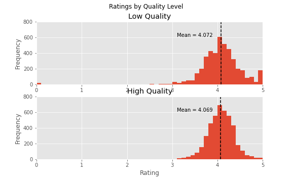

# 
 Are higher ranked Goodreads "must read books" rated higher? 

## 
 A 'Quality' Analysis 

## Introduction
Goodreads.com is a social media website that allows users to share, rate, and review books they have read (or haven't, who knows?). Readers are able to rate the books they read on a 5-point scale:

* 1 star – didn't like it
* 2 stars – it was OK
* 3 stars – liked it
* 4 stars – really liked it
* 5 stars – it was amazing

Another freature of goodreads is the book lists they put together. Go to their [Listopia](https://www.goodreads.com/list)
page to check out some of the lists. Lists can be added to by anyone, and for that reason, lists can grow to be extremely large. Even lists that are supposed to be "Top 100" can have lists that stretch well past the century mark. Additionally, many books towards the end of the list (or not even near the end, depending on how long the list is) are books that were added by only one person and have only one vote. These books also are more likely to have full 5-star ratings, but this is because they have only been rated a handful of times. These books with one vote and a glowing rating because it was one person's favorite book, but no one else has ever heard of it, are dealt with below.

## Motivation and Question
It only takes a short time on goodreads to realize that the ratings on books appear to be all over the map. The only consistency I have been able to determine is that the book ratings appear to have no consistency at all! That, and the fact that almost all books that have at least a handful of ratings rarely seem to fall below about a 3. This probably speaks to the theory that most people will post and rate books they liked. Unfortunately, if I am looking for my next quality book to read, I am not sure if I can trust the book ratings.

Therefore, the question I will be asking is whether books that are "higher quality" are actually rated higher on goodreads. Since "higher quality" is a subjective measure, I have chosen to use the [Books Everyone Should Read At Least Once](https://www.goodreads.com/list/show/264.Books_That_Everyone_Should_Read_At_Least_Once) list on goodreads, because this list contains many higly ranked books that are widely regarded as classics (or modern classics).

## Data

The data consists of the top 8,800 books from the aforementioned list. This amount of books allows for a robust data set before running too far into the list of "single vote and few rating" books described above. In fact, in a further effort to combat this problem, after running an initial test on the entire list, the data set is subsetted to 6,895 books that have been rated at least 10 times, and have at least two votes and the tests are run again on that sample.

This data set contains several features for to analyze the question:

* Ranking of the book in the list
* Score that determines the ranking in the list (based on votes and ratings)
* Average rating of the book on a 5-point scale
* Indicator of higher versus lower quality books

Higher versus lower quality books in the list are defined by a simple metric. If they are in the top half of the list, they are considered "higher quality" books and if they are in the bottom half of the list, they are considered "lower quality" books.
* Note - books that were tied on score share the same rank. As a result, the high and low ranked books categories do not each contain exactly half of the books.

## Results

### Ovearll data set (n=8,800)

A scatter plot of average rating of each book against its score does not show any discernible difference in the mean of the ratings as score increases.

This histogram of the ratings show that they are normally distributed
* Mean = 4.071
* Standard Deviation = 0.379

