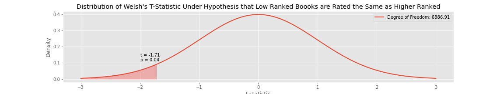

# Goodreads.com Must Read Books
## A 'quality' analysis'
## Are higher ranked Goodreads "must read books" rated higher?

## About
Goodreads.com is a social media website that allows users to share, rate, and review books they have read. Readers are able to rate the books they read on a 5-point scale:

* 1 star – didn't like it
* 2 stars – it was OK
* 3 stars – liked it
* 4 stars – really liked it
* 5 stars – it was amazing

Another freature of goodreads is the book lists they put together. Go to their [Listopia](https://www.goodreads.com/list)
page to check out some of the lists. Lists can be added to by anyone, and for that reason, lists can grow to be extremely large. Even lists that are supposed to be "Top 100" can have lists that stretch well past the century mark.

## Motivation and Question
It only takes a short time on goodreads to realize that the ratings on books appear to be all over the map. The only consistency I have been able to determine is that the book ratings appear to have no consistency at all! That, and the fact that almost all books that have at least a handful of ratings rarely seem to fall below about a 3. This probably speaks to the theory that most people will post and rate books they liked. Unfortunately, if I am looking for my next quality book to read, I am not sure if I can trust the book ratings.

Therefore, the question I will be asking is whether books that are "higher quality" are actually rated higher on goodreads. Since "higher quality" is a subjective measure, I have chosen to use the [Books Everyone Should Read At Least Once](https://www.goodreads.com/list/show/264.Books_That_Everyone_Should_Read_At_Least_Once) list on goodreads, because this list contains many higly ranked books that are widely regarded as classics (or modern classics).

